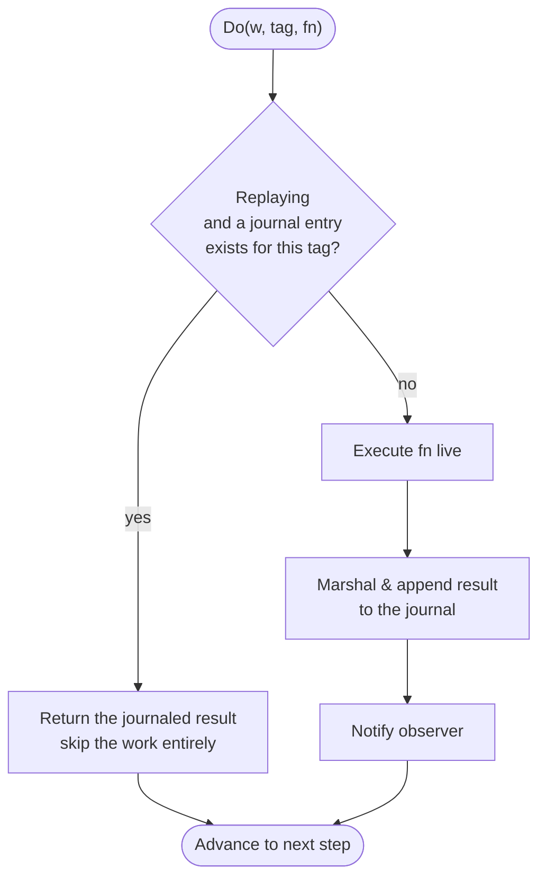
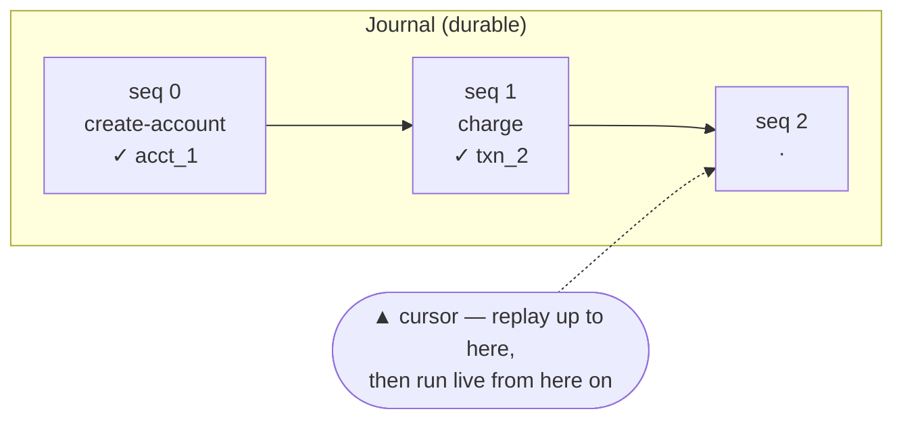
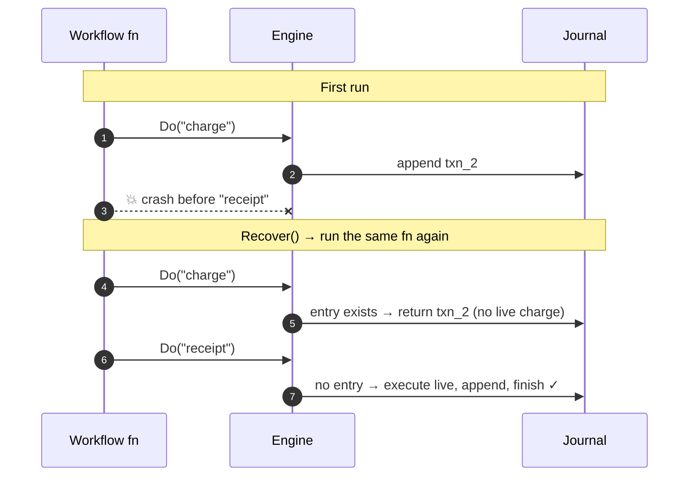
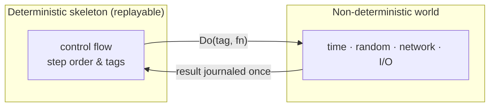
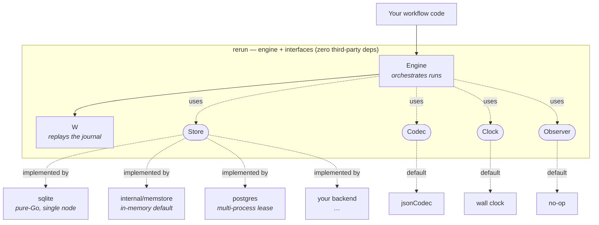
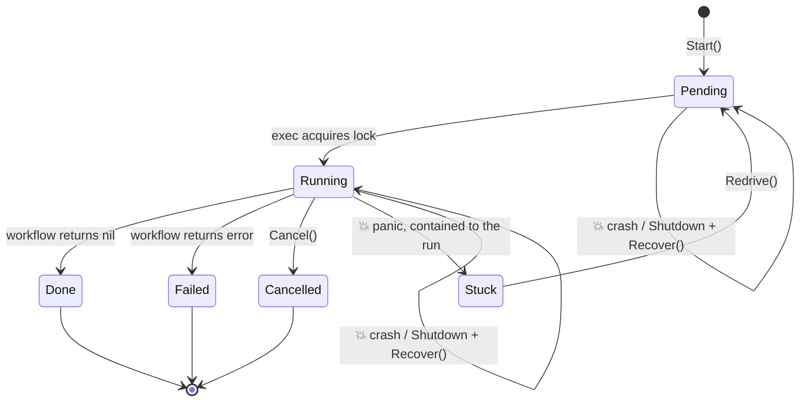

<div align="center">

<pre>
██████╗ ███████╗██████╗ ██╗   ██╗███╗   ██╗
██╔══██╗██╔════╝██╔══██╗██║   ██║████╗  ██║
██████╔╝█████╗  ██████╔╝██║   ██║██╔██╗ ██║
██╔══██╗██╔══╝  ██╔══██╗██║   ██║██║╚██╗██║
██║  ██║███████╗██║  ██║╚██████╔╝██║ ╚████║
╚═╝  ╚═╝╚══════╝╚═╝  ╚═╝ ╚═════╝ ╚═╝  ╚═══╝
</pre>

### ⟲ Durable execution for Go &nbsp;·&nbsp; crash · restart · resume

**A multi-step process that runs to completion — even when the machine crashes halfway through and restarts hours later. It resumes from where it left off instead of starting over.**

[](https://github.com/sylvester-francis/rerun/actions/workflows/ci.yml)
[](https://pkg.go.dev/github.com/sylvester-francis/rerun)
[](https://go.dev/dl/)
[](#design)
[](#guarantees--non-goals)
[](LICENSE)

[**Docs & landing site**](https://sylvester-francis.github.io/rerun/) · [**API reference**](https://pkg.go.dev/github.com/sylvester-francis/rerun) · [**Guide**](docs/using-rerun.md) · [**Known issues**](KNOWN-ISSUES.md)

`Do` · `Sleep` · `Recover` — that's the whole API.

</div>

---

## The thirty-second pitch

Completed steps are replayed from a journal rather than re-executed, so with idempotent steps there are **no double charges, no skipped steps, and no half-finished state** left behind.

It's the guarantee you'd otherwise reach for Temporal to get — without the cluster. No servers, no queues, no YAML. `rerun` is the *core idea*, not the platform around it: under 1000 lines of engine, a pure-Go SQLite default (zero CGO via `modernc.org/sqlite`), and **zero third-party dependencies in the core**.

```go
e.Handle("checkout", func(w *rerun.W) error {
	txn, err := rerun.Do(w, "charge", func(ctx context.Context) (string, error) {
		return chargeCard(ctx, order) // runs once, ever — even across crashes
	})
	if err != nil {
		return err
	}

	rerun.Sleep(w, 24*time.Hour) // durable: survives restarts, skipped on replay

	_, err = rerun.Do(w, "receipt", func(ctx context.Context) (any, error) {
		return nil, sendReceipt(ctx, txn)
	})
	return err
})
```

If the process dies after `charge` but before `receipt`, the next boot's `Recover` replays the journal: `charge` returns its stored result **without re-charging**, the `Sleep` is skipped because its deadline already passed, and execution continues into `receipt`.

> **New to durable execution?** [`docs/durable-execution.md`](docs/durable-execution.md) is a concept-to-code tour — the *why*, the one rule, and how every idea maps to the source.

## How it works

A workflow is an ordinary Go function. Each step is wrapped in `Do`, which makes a single decision — *have I already done this?*



Recovery is just *running the function again*. Steps that completed before the crash replay instantly from the journal; the first step without an entry executes for real; everything after it runs forward normally. The function is written once, as if crashes didn't exist, and the engine makes it crash-proof by recording and replaying.

> **The thing you persist is not _which step you reached_, but _the result every completed step produced_.** With the results in hand, recovery isn't guesswork.

## Mental models

Four ways to hold the idea in your head. Pick whichever one sticks.

**1 · The journal is the source of truth, the code is a cursor.** Your function isn't the state — the journal is. The function is just a pointer that walks the journal forward, executing only past its end.



**2 · A crash just rewinds the tape; replay fast-forwards it.** Restarting re-runs the function from the top, but completed steps return instantly from the journal — no card re-charged, no email re-sent — until execution reaches the first step the crash never recorded.



**3 · `Do` is the membrane between two worlds.** Inside a `Do`, the messy non-deterministic world — clocks, randomness, network — runs once and gets frozen into the journal. Outside, the workflow body must be a deterministic skeleton, replayable byte-for-byte.



**4 · One goroutine per run, parked for free.** Each run drives a plain top-to-bottom function on its own goroutine. A `Sleep` or a slow step just blocks that goroutine cheaply, so thousands of long-lived workflows sit idle at once without a thread each.

## Install

```sh
go get github.com/sylvester-francis/rerun
```

The core engine needs only Go 1.18+ (generics power the type-safe `Do[T]`). The bundled pure-Go SQLite and Postgres backends pull the module's minimum to **Go 1.25**; if you need a lower floor, use the in-memory store or your own `Store` and those backends never enter your build.

## Quick start

```go
package main

import (
	"context"
	"time"

	"github.com/sylvester-francis/rerun"
	"github.com/sylvester-francis/rerun/sqlite"
)

func main() {
	ctx := context.Background()

	// Swap sqlite.New(path) for postgres.New(dsn) to run across processes —
	// the workflow code below is identical against any Store.
	e := rerun.New(sqlite.New("rerun.db"))

	e.Handle("checkout", func(w *rerun.W) error {
		orderID, _ := rerun.Input[string](w) // the seed passed to Start, replayed on recovery

		txn, err := rerun.Do(w, "charge", func(ctx context.Context) (string, error) {
			return chargeCard(ctx, orderID)
		})
		if err != nil {
			return err
		}

		if err := rerun.Sleep(w, 24*time.Hour); err != nil {
			return err
		}

		_, err = rerun.Do(w, "receipt", func(ctx context.Context) (any, error) {
			return nil, sendReceipt(ctx, txn)
		})
		return err
	})

	e.Recover(ctx)                                  // resume anything mid-flight before this boot
	e.Start(ctx, "checkout", "run-1", "order-4711") // new run "run-1" seeded with an order ID
}
```

## The API surface

The whole surface a user touches — small because the idea is small:

| Symbol | What it's for |
|---|---|
| `New(store, ...Opt)` | Build an engine over a `Store`. |
| `WithCodec` / `WithClock` / `WithObserver` / `WithStoreTimeout` | Functional options for serialization, time, lifecycle events, and the store-write timeout. |
| `Handle(name, fn)` | Register a workflow function. |
| `Start(ctx, name, runID, in...)` | Launch a new run in its own goroutine, with an optional atomic input. |
| `Recover(ctx)` | Re-launch every incomplete run after a restart. |
| `Do[T](w, tag, fn)` | Run a step once; return its journaled value on replay. |
| `DoTimeout[T](w, tag, d, fn)` | A `Do` with a per-step deadline; the timeout outcome is journaled. |
| `Sleep(w, d)` | A durable delay that survives restarts and is skipped on replay. |
| `Retry[T](w, tag, policy, fn)` | Retry a step with durable backoff; each attempt is its own journaled step. |
| `Input[T](w)` / `Return[T](w, v)` / `Result[T](ctx, e, id)` | Pass a value into a run and hand one back, both journaled. |

For multi-run and multi-process workloads, a few more primitives build on the same journal:

| Symbol | What it's for |
|---|---|
| `Wait[T](w, name)` / `Deliver(ctx, runID, name, v)` | Block on an external event (an approval, a webhook) and journal it, so it survives a crash. Needs a `Signaler` store. |
| `Version(w, changeID, min, max)` | Pin an in-flight run to its original code path so a deploy that changes the workflow doesn't break it. |
| `Cancel(ctx, runID)` | Stop a run — instantly if it's in this process, or cross-process (eventual) with `WithCancelPoll` + a `Canceller` store. Durable when the store records it; finishes `Cancelled`. |
| `Shutdown(ctx)` | Park every in-flight run and refuse new work, so a graceful stop loses nothing — runs stay incomplete and resume on the next `Recover`. |
| `Redrive(ctx, runID)` | Reset a `Stuck` run to `Pending` after shipping a fix, so the next `Recover` claims it again. |

Everything else is an interface a backend implements, or an internal detail.

## The one rule: determinism

Replay matches journaled steps to your code **by tag and order**. Your workflow must issue the same sequence of `Do`/`Sleep` calls, with the same tags, every time it runs with the same inputs. Anything non-deterministic — the clock, a random number, a read whose result steers a branch — must be captured *inside* a `Do` so its value is journaled and replayed, not recomputed.

```go
// ✗ Trap: the branch can differ between the original run and the replay.
if time.Now().Hour() < 12 {
	rerun.Do(w, "morning", ...)
} else {
	rerun.Do(w, "evening", ...)
}

// ✓ Fix: journal the decision, then branch on the recorded value.
morning, _ := rerun.Do(w, "is-morning", func(ctx context.Context) (bool, error) {
	return time.Now().Hour() < 12, nil
})
if morning {
	rerun.Do(w, "morning", ...)
} else {
	rerun.Do(w, "evening", ...)
}
```

The engine enforces this rather than hope for it: if a `Do` presents a tag that doesn't match the journal at that position, it **panics with the exact position and both tags** — a determinism bug fails loudly at the first divergence instead of quietly producing wrong results.

> Errors are results too. A step that returns "card declined" on the first run reproduces that *same* error on replay — it does not re-run the charge hoping for a different answer. But the replayed error is a `*StepError` carrying the message, **not the original type**: branch on *whether* a step failed, never on an error's type or sentinel (`errors.As`/`errors.Is`), and capture any why-it-failed decision as a journaled value.

## Patterns fall out of the primitive

`Do` is the only primitive; useful shapes are just loops and conditionals over it.

**Retry** — each attempt is its own journaled step:

```go
func chargeWithRetry(w *rerun.W) (string, error) {
	var last error
	for attempt := 0; attempt < 3; attempt++ {
		txn, err := rerun.Do(w, fmt.Sprintf("charge:attempt-%d", attempt),
			func(ctx context.Context) (string, error) { return charge(ctx) })
		if err == nil {
			return txn, nil
		}
		last = err
	}
	return "", fmt.Errorf("charge failed after retries: %w", last)
}
```

On replay the whole attempt sequence is reproduced from the journal without calling the processor again.

## Beyond the basics

The single-process engine extends to the hard problems of durable execution without changing its shape — each is the same insight again (*anything nondeterministic becomes a journaled step*), and each ships with a runnable example.

| Problem | Mechanism | Example |
|---|---|---|
| **Multi-process execution** | A non-blocking try-lock lease on `Guarder`; the `postgres` backend uses `pg_try_advisory_lock` on a dedicated connection for exactly-once dispatch across machines. | `examples/workers` |
| **Durable timers** | `Sleep` journals the absolute deadline; on recovery it waits only the remainder, recomputed from the journal. | `examples/durabletimer` |
| **Signals & external events** | `Wait[T]` is a `Do` whose value arrives from an external mailbox (`Signaler`); `Deliver` deposits it, and it survives a crash because it's journaled. | `examples/signals` |
| **Versioning across deploys** | `Version` journals the code-path version so in-flight runs replay their original branch while new runs take the new one. | `examples/versioning` |

## Design

Dependencies point one way only — inward, toward abstractions. The engine knows nothing about SQLite; SQLite knows nothing about the engine. Both meet at the `Store` interface.



> Arrows are dependencies. Nothing inside `Core` points outward at a concrete implementation — adapters depend on the interfaces, never the reverse. The Postgres backend was added exactly this way: a new package satisfying `Store`, zero lines of engine source changed. A protobuf codec or a metrics observer slots in the same way.

Backends and extensions never import the engine; the engine imports no adapter. Each piece changes for exactly one reason:

- **`Engine`** orchestrates runs (one goroutine per run — thousands park cheaply on a `Sleep`).
- **`W`** replays the journal.
- **`Store`** persists logs and run metadata.
- **`Codec`** serializes step results (JSON by default).
- **`Clock`** tells time (wall clock by default; injectable for tests).
- **`Observer`** receives lifecycle events for logging and metrics (no-op by default).

### Pluggable storage, segmented by need

`Store` composes three small interfaces so consumers depend only on what they use:

| Interface | Methods | Who needs it |
|---|---|---|
| `Writer` | `Create`, `Append`, `Finish` | the hot path |
| `Reader` | `LoadLogs`, `Incomplete` | a monitoring dashboard, read-only |
| `Guarder` | `Acquire` | mutual exclusion; a test double makes it a no-op |

Any `Store` is drop-in — SQLite, Postgres, or in-memory — and the engine can't tell the difference. The contract suite ships as a **public package** (`storetest`) so anyone can write a backend and prove it correct against the same bar the in-tree backends meet:

```go
func TestSQLiteStore(t *testing.T) {
	storetest.RunStoreContract(t, func() rerun.Store {
		return sqlite.New(t.TempDir() + "/test.db")
	})
}
```

### Configuration

```go
e := rerun.New(store,
	rerun.WithCodec(myCodec),
	rerun.WithClock(myClock),
	rerun.WithObserver(myObserver),
)
```

### Run lifecycle

A crash or `Shutdown` **parks** in-flight runs — they stay `Running` (or `Pending`) and resume when a later engine calls `Recover`; only `Cancel` produces `Cancelled`. A run the engine refuses to execute — a determinism panic, a corrupt journal, or a workflow that shrank — becomes `Stuck` and is excluded from recovery until `Redrive` re-admits it after a fix.



## When it panics vs. returns an error

- **Panics** for *programmer errors* that can't be recovered: non-determinism (tag mismatch), journal corruption, duplicate workflow registration. A panic inside a run is **contained to that run** — the run becomes `Stuck` and the process keeps serving its other runs.
- **Errors** for *operational failures*: the store is unavailable, the context is cancelled, a step returns an error.

## Repository layout

```
rerun/
├── store.go            Run, Log, Status, the Store/Writer/Reader/Guarder interfaces
├── codec.go            serialization seam, JSON by default
├── clock.go            time seam, wall clock by default
├── hooks.go            Observer seam, no-op by default
├── engine.go           the engine: registry, New, Handle, options
├── workflow.go         Do, replayStep, liveStep, Sleep
├── run.go              Start, exec, Recover
├── input.go            Input[T], the run's journaled seed
├── signal.go           Signaler, Deliver, Wait[T] — steps whose value comes from outside
├── version.go          Version — pin in-flight runs across a deploy
├── errors.go           StepError, so errors survive replay
├── internal/memstore.go   in-process store (the default and a test aid)
├── storetest/             importable Store contract suite for any backend
├── sqlite/sqlite.go       persistent single-node backend (pure Go, zero CGO)
├── postgres/postgres.go   multi-process backend (advisory-lock lease)
├── tools/mutate/          dependency-free mutation tester
└── examples/              skeleton · recover · durablesleep · capstone
                           workers · durabletimer · signals · versioning
```

## Testing

```sh
go test -race ./...   # the whole suite, race-clean
go vet ./...
make mutate           # mutation testing: known faults are killed
make pg-test          # Postgres store contract against an ephemeral container (needs Docker)
```

The same `Store` contract runs against all three backends — in-memory, SQLite (a real file), and Postgres (a real database) — so the durability claim is proven, not asserted.

## Guarantees & non-goals

**`rerun` is `v0.x` and unstable** — the API may change between minor versions.

**What it guarantees:** runs are **durable** and **resumable**. Side effects are **at-least-once**, and **exactly-once only when your steps are idempotent**. A step repeats only if the process dies in the narrow window *after* its side effect runs and *before* its journal entry commits — which is why production steps (a card charge, an email) are written to be idempotent. Any claim of plain "exactly once" would be dishonest.

**Non-goals (deliberately not provided):**

- **No distributed scheduler.** A sleeping run parks a cheap goroutine; that scales to thousands, not to a durable-timer service polling millions. `Incomplete` plus a due-before query is where that would attach — a planned `v0.2`.
- **Not a Temporal replacement.** `rerun` is the core idea — journal and replay — not the platform (UI, namespaces, cross-language SDKs, activity workers) around it.

Retries with durable backoff (`Retry`), per-step timeouts (`DoTimeout`), typed results (`Return`/`Result`), durable signals, and run cancellation — in-process, or cross-process (eventual) via `WithCancelPoll` — are all built in. See [`docs/using-rerun.md`](docs/using-rerun.md).

## Documentation

- [`docs/using-rerun.md`](docs/using-rerun.md) — how to wire `rerun` into a real application: input/result, retries, timeouts, cancellation, signals, choosing a backend, and the rules you must follow.
- [`docs/durable-execution.md`](docs/durable-execution.md) — a concept-to-code tour of durable execution and this codebase; the *why* behind the *how*.
- [`docs/adr/`](docs/adr/) — architecture decision records: the *why* behind the key choices (journal as truth, one recovery path, park-not-fail, and more).
- [`CONTRIBUTING.md`](CONTRIBUTING.md) · [`SECURITY.md`](SECURITY.md) · [`CHANGELOG.md`](CHANGELOG.md)
- API reference on [pkg.go.dev](https://pkg.go.dev/github.com/sylvester-francis/rerun).

## Contributing

Contributions are welcome. Good places to start:

- The open [issues](https://github.com/sylvester-francis/rerun/issues), including anything tagged [`good first issue`](https://github.com/sylvester-francis/rerun/labels/good%20first%20issue) or [`help wanted`](https://github.com/sylvester-francis/rerun/labels/help%20wanted).
- The [decision records](docs/adr/) and the determinism rules explain the guarantees rerun makes, so a change preserves them rather than working around them.

Build and test with `go test -race ./...` (see [`CONTRIBUTING.md`](CONTRIBUTING.md)). Please sign your commits off (`git commit -s`); no CLA.

## Author

Created and maintained by [Sylvester Francis](https://github.com/sylvester-francis).

## License

[Apache License 2.0](LICENSE) © 2026 Sylvester Francis, with attribution retained
per the [`NOTICE`](NOTICE) file.

Derivative works must retain the attribution notices in [NOTICE](NOTICE), per Section 4(d) of the license.
