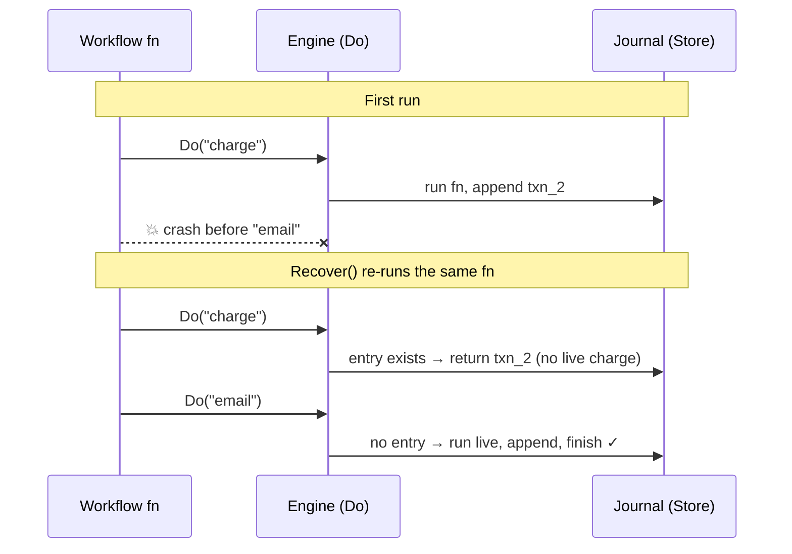
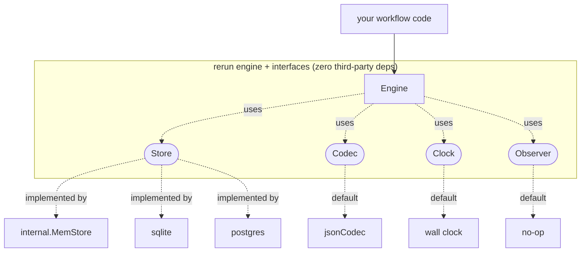

<!--
Copyright 2026 Sylvester Francis
Licensed under the Apache License, Version 2.0. See the LICENSE file.
-->

# Understanding Durable Execution: A Guided Tour of `rerun`

This document explains what durable execution *is*, why it is harder than it
looks, and how `rerun` implements it in a few hundred lines of Go. It is meant
for an engineer who has never built one of these systems. By the end you should
be able to read the source with a map in hand and drop `rerun` into your own
service. Every concept is tied to the exact file and function that implements
it.

---

## 1. The problem

Consider a signup: create an account, charge a card, wait a day, send a welcome
email. Four steps, each with a real side effect. Now the machine crashes after
the charge but before the email, and restarts an hour later. What should happen?

Two naive answers both fail:

- **Start over.** The card gets charged twice. Any step with a side effect is
  dangerous to repeat blindly.
- **Remember which step you reached.** A status field like `charged` tells you a
  step *finished* but not *what it produced* — you don't have the transaction ID
  the charge returned, so you can't continue. You also can't tell, on restart,
  whether the crash landed before or after the side effect committed.

The insight that makes durable execution work is one sentence:

> **Persist the *result* every completed step produced — not *which step* you
> reached.**

With every completed step's result on durable storage, recovery is no longer
guesswork. You re-run the function from the top, and each step that already has
a recorded result returns it *instead of running again*. The first step with no
record runs for real, and everything after it proceeds normally. The workflow is
written once, as if crashes could not happen, and the engine makes it
crash-proof by recording and replaying.

That record is the **journal**. This mechanism is **journal-and-replay**.

---

## 2. The mechanism: `Do`, and replay

A `rerun` workflow is an ordinary Go function. Each step is wrapped in `Do`
(`workflow.go`), which makes exactly one decision: *have I already done this?*

```go
func Do[T any](w *W, tag string, fn func(context.Context) (T, error)) (T, error) {
	if w.replay && w.seq < len(w.logs) {
		return replayStep[T](w, tag)   // return the journaled result; don't run fn
	}
	return liveStep(w, tag, fn)        // run fn, journal its result, return it
}
```

`replayStep` reads the journal entry at the current cursor and returns its stored
value. `liveStep` runs the function, marshals the result, appends it to the
store, notifies the observer, and advances the cursor. `W` (the workflow handle)
carries the loaded journal and the cursor:

```go
type W struct {
	RunID  string
	seq    int      // cursor: which step we're on
	logs   []Log    // the journal loaded at recovery
	replay bool      // true until the first live step
	// ...
}
```

Recovery is *running the same function again*. `exec` (`run.go`) loads the
journal, sets `replay = len(logs) > 0`, and calls the workflow. Completed steps
replay instantly; the first step past the journal's end runs live:



The crucial property: **recovery is the normal path, not a second code path.**
`Recover` (`run.go`) simply finds unfinished runs and calls the same `exec` a
fresh `Start` uses — the only difference is a pre-populated journal. Fewer paths,
fewer ways to be wrong.

---

## 3. The napkin API

The entire surface a user touches is small, because the idea is small:

| Symbol | File | Purpose |
|---|---|---|
| `New(store, ...Opt)` | `engine.go` | build an engine over a `Store` |
| `Handle(name, fn)` | `engine.go` | register a workflow |
| `Start(ctx, name, id, in...)` | `run.go` | launch a run (optional journaled input) |
| `Recover(ctx)` | `run.go` | resume every unfinished run after a restart |
| `Do[T](w, tag, fn)` | `workflow.go` | run a step once; replay its result |
| `Sleep(w, d)` | `workflow.go` | a durable delay |
| `Input[T](w)` | `input.go` | read the run's seed |

Three concepts do the real work: **`Do`** (run once), **`Sleep`** (wait
durably), **`Recover`** (resume). No servers, no queues, no DSL.

---

## 4. The one rule: determinism

Replay matches journaled results to `Do` calls **by position and tag**. The
first `Do` a run makes is journal entry 0, the second is entry 1, and so on. For
that matching to stay correct, the workflow must issue the *same sequence of
steps, with the same tags,* every time it runs on the same input.

This means the workflow body must be **deterministic**. Anything that varies
between runs — the clock, a random number, a database read whose result steers a
branch — must be captured *inside a `Do`* so its value is journaled once and
replayed, never recomputed:

```go
// ✗ Wrong: the branch can differ between the first run and replay.
if time.Now().Hour() < 12 {
	rerun.Do(w, "morning", ...)
} else {
	rerun.Do(w, "evening", ...)
}

// ✓ Right: journal the decision, then branch on the recorded value.
morning, _ := rerun.Do(w, "is-morning", func(ctx context.Context) (bool, error) {
	return time.Now().Hour() < 12, nil
})
if morning { ... } else { ... }
```

`rerun` *enforces* this rather than hoping for it. In `replayStep`, the tag the
code presents is checked against the tag stored at that position **before**
anything else, and a mismatch **panics**:

```go
if l.Tag != tag {
	panic(fmt.Sprintf(
		"rerun: determinism broken at seq %d in run %s: journal=%q code=%q",
		w.seq, w.RunID, l.Tag, tag))
}
```

A determinism bug fails loud and early, at the exact position, instead of
silently handing the result of one step to a different step and corrupting the
run. This panic is not optional politeness — a bad match makes every later match
meaningless, so continuing would be worse than crashing.

One consequence worth stating: **errors are results too.** A step that returns
"card declined" journals that error (`liveStep` records `l.Err`), and on replay
`replayStep` reconstructs it as a `*StepError` (`errors.go`) and returns the same
error — it does not re-run the charge hoping for a different answer.

The reconstruction preserves the *message*, not the original concrete *type*: a
replayed failure is always a `*StepError`. So the determinism rule reaches errors
too — never branch on an error's type or sentinel (`errors.As`/`errors.Is` against
your own error), because that check passes on the live run and fails on replay.
Branch on *whether* a step errored; to steer control flow on *why*, journal the
reason as a value inside the `Do` and branch on that.

---

## 5. Durable time: a sleep is a deadline

A workflow that sleeps a day must survive a restart in the middle of that day.
`Sleep` (`workflow.go`) achieves this by journaling the *absolute deadline* as an
ordinary instantaneous step, then waiting only the time that remains:

```go
func Sleep(w *W, d time.Duration) error {
	deadline, _ := Do(w, fmt.Sprintf("sleep:%v", d), func(context.Context) (int64, error) {
		return w.eng.clock.Now().Add(d).UnixNano(), nil   // journaled once
	})
	remaining := time.Unix(0, deadline).Sub(w.eng.clock.Now())
	if remaining <= 0 {
		return nil                                        // deadline already passed
	}
	select {
	case <-w.eng.clock.After(remaining):
		return nil
	case <-w.ctx.Done():
		return w.ctx.Err()                                // cancellation propagates
	}
}
```

The durable fact (the deadline) is a journaled `Do`, so it inherits everything
replay gives you. The wait is deliberately *not* journaled: waiting is not a
fact to remember, it is a function of the deadline and the current time, so it is
recomputed on every run. Restart with time left and it waits the remainder;
restart after the deadline and it returns instantly. Separating the durable fact
from the derived wait is the whole trick.

---

## 6. The seams: SOLID in a small library

`rerun`'s engine depends only on interfaces it defines. Concrete implementations
depend on those same interfaces. **Nothing points outward at a concrete type.**



There are four seams:

- **`Store`** (`store.go`) persists runs and journal entries.
- **`Codec`** (`codec.go`) serializes step results; JSON by default.
- **`Clock`** (`clock.go`) tells time; the wall clock by default, a fake clock in
  tests. This seam is what makes a one-day sleep testable in microseconds.
- **`Observer`** (`hooks.go`) receives lifecycle events for logging and metrics;
  a no-op by default. Observers take values, not pointers, so they cannot mutate
  engine state.

Each is swapped with a functional option (`WithCodec`, `WithClock`,
`WithObserver` in `engine.go`). The **dependency rule** — adding a backend
changes zero lines of engine code — is not aspirational here; the `postgres`
package was added exactly that way.

### Interface segregation: why `Store` is split three ways

`Store` composes three smaller interfaces so a consumer depends only on what it
uses:

| Interface | Methods | Who needs only this |
|---|---|---|
| `Writer` | `Create`, `Append`, `Finish` | the hot path; a write-ahead-log shipper |
| `Reader` | `LoadLogs`, `Incomplete` | a read-only monitoring dashboard |
| `Guarder` | `Acquire` | a lock manager; a test double as a no-op |

The split costs nothing (interfaces compose by embedding) and pays off when a
backend or a tool needs only one face.

### The contract suite

Because any `Store` is a drop-in, the library ships the *proof* that a backend is
correct as a public, importable package: `storetest.RunStoreContract`
(`storetest/storetest.go`). Every backend runs the same sub-tests — create and
load, sequence ordering, incomplete filtering, status transitions, lease
exclusivity, duplicate rejection. Writing a new backend means implementing six
methods and passing one function:

```go
func TestMyStore(t *testing.T) {
	storetest.RunStoreContract(t, func() rerun.Store { return myStore() })
}
```

The suite runs against all three shipped backends — in-memory, SQLite (a real
file), and Postgres (a real database) — so "any backend is a drop-in" is a tested
claim, not a hope. The single most important line in the SQL backends is
`ORDER BY seq` in `LoadLogs`: replay matches by position, so rows must come back
in sequence order. The contract's "logs return in seq order" case inserts
entries `2, 0, 1` specifically to catch a backend that forgot it.

---

## 7. When it panics, and when it returns an error

The split is principled, and it is the guardrail against hiding corruption:

- **Panic on programmer errors** — a determinism violation, a duplicate workflow
  name, a result that cannot be serialized, a journal payload that will not
  unmarshal into the declared type. The program is built wrong; failing loud is
  the service.
- **Return errors for operational conditions** — a step's own business failure or
  a cancelled context. These are expected in a running system, and the caller
  decides what to do.

A panic inside a run is **contained**, not fatal to the process. The engine's
per-run recover marks the run `Stuck` (a terminal-ish status excluded from
recovery) and keeps serving every other run; `Redrive` re-admits a `Stuck` run
once you ship a fix. A panic must never escape a run's goroutine. Transient
trouble is gentler still: a failed journal write, a lost lease, or an unknown
workflow name (another worker in the fleet may own it) *parks* the run — it stays
incomplete and a later claim retries it — rather than sticking or failing it.

The litmus test: *could this happen in a correct program talking to a healthy
world?* If yes, it is an operational condition (an error, or a park). If it can
only happen because the code or the stored data is wrong, it is a panic — and
that panic sticks the one run, not the process. Converting the determinism panic
into a `Failed` status would trade a screaming failure for a silent one — that is
a bug, not defensiveness.

---

## 8. The honest guarantee

It matters to state this precisely, because overstating it is a trap:

> `rerun` is **durable** and **resumable**; **at-least-once** for side effects;
> **exactly-once only when steps are idempotent.**

A step repeats only if the process dies in the narrow window *after* its side
effect runs and *before* its journal entry commits. That window is why
production steps — a charge, an email — are written to be idempotent (a keyed
request the processor deduplicates). Any claim of plain "exactly once" without
that caveat is dishonest. See the README's *Guarantees & non-goals* for what
`rerun` deliberately does not do (built-in retries, timeouts, cancellation, a
distributed scheduler).

---

## 9. Beyond one process: the hard problems

Everything past a single process is the same Day-2 insight applied again —
*anything nondeterministic becomes a journaled step* — so the engine's shape
never changes. Each ships with a runnable example.

**Multi-process execution** (`examples/workers`). If two workers recover the same
run, it must not execute twice. `Guarder.Acquire` is a **non-blocking try-lock**:
the first worker leases the run, the rest get `acquired == false` and skip it
(`exec` returns early). The in-memory store leases with a held set; the
`postgres` backend uses `pg_try_advisory_lock` on a *dedicated connection*, which
is released automatically when a dead worker's connection drops — no lease
expiry, no heartbeat, no reaper. The `postgres_test.go` cross-process test proves
one session is refused while another holds the lease.

**Durable timers** (`examples/durabletimer`) are section 5's `Sleep`: the deadline
is journaled, so a crash mid-sleep resumes and waits only the remainder.

**Signals** (`examples/signals`, `signal.go`) are steps whose value comes from
outside — an approval click, a webhook. `Wait[T]` is a `Do` that blocks on a
mailbox instead of computing; `Deliver` deposits an event from outside the
workflow. Because the received value returns from a `Do`, it is journaled and
replayed like any other step: a workflow that waited three days for an approval
resumes with the approval already in hand. `Signaler` is an *optional* store
capability — a backend opts in — which is interface segregation again.

**Versioning across deploys** (`examples/versioning`, `version.go`). Shipping new
workflow code that inserts a step would break in-flight runs, whose journals do
not have it, at the determinism check. `Version(w, changeID, min, max)` journals
the version the first time it is reached; in-flight runs replay their pinned
version and keep their original branch, while new runs take the new one. Branch
on the returned int. It panics if a journaled version falls outside `[min, max]`
— a rollback guard that turns an undetectable wrong-branch bug into an obvious
crash.

---

## 10. Plugging it into your service

```go
import (
	"github.com/sylvester-francis/rerun"
	"github.com/sylvester-francis/rerun/sqlite"
)

e := rerun.New(sqlite.New("rerun.db"))

e.Handle("signup", func(w *rerun.W) error {
	id, err := rerun.Do(w, "create-account", func(ctx context.Context) (string, error) {
		return createAccount(ctx)
	})
	if err != nil {
		return err
	}
	rerun.Sleep(w, 24*time.Hour)
	rerun.Do(w, "welcome-email", func(ctx context.Context) (struct{}, error) {
		return struct{}{}, sendEmail(ctx, id) // write this to be idempotent
	})
	return nil
})

func main() {
	e.Recover(ctx)                        // resume anything mid-flight before this boot
	e.Start(ctx, "signup", "user-42")     // launch a new run
}
```

**Two things you must do**, and they are the whole discipline:

1. **Wrap every side effect and every nondeterministic read in a `Do`** with a
   stable tag. If it touches the clock, randomness, the network, or a database,
   it belongs inside a `Do`.
2. **Call `Recover(ctx)` on startup** so runs left in flight by the last process
   resume.

**Choosing a backend** is a one-line swap, because the workflow code is identical
against any `Store`:

| Backend | Use it for |
|---|---|
| `internal.MemStore` | tests and single-process programs that need not outlive a restart |
| `sqlite.New(path)` | a persistent single node; pure Go, no CGO, a single file |
| `postgres.New(dsn)` | multiple processes or machines sharing runs, with a real lease |

---

## 11. Why you can trust it

Two mechanisms back the correctness claims:

- **One contract, three backends.** `storetest.RunStoreContract` runs against the
  in-memory store, SQLite, and Postgres, so the durability and lease guarantees
  are proven against real storage, not asserted.
- **Mutation testing** (`tools/mutate`). Coverage says a line ran; mutation says
  an assertion would *notice it being wrong*. The tool introduces known faults —
  flip the replay guard's `&&` to `||`, weaken its `<` to `<=`, invert the
  determinism check, drop a journaled error, mark a success as failed — and
  confirms a test fails for each. Five faults are killed; one documented
  *equivalent* mutant (removing the redundant `w.replay = false`) is expected to
  survive and is recorded rather than chased. A perfect kill rate is a number to
  interrogate, not to game.

The lesson underneath the whole library: the journal is the source of truth, and
the workflow function is just a cursor that walks it forward. Hold that idea and
the rest of the code reads itself.
